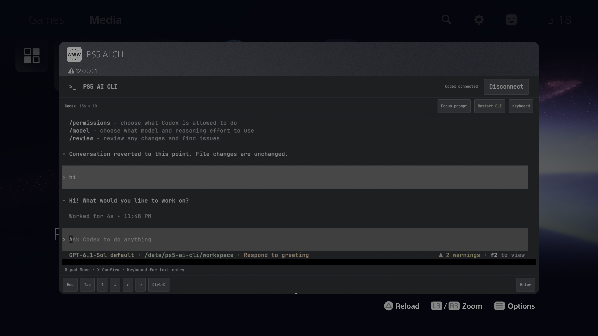

# PS5 AI CLI

### Open Codex on your PS5. Use the CLI you already know.

PS5 AI CLI brings the native [OpenAI Codex CLI](https://github.com/openai/codex)
to jailbroken PlayStation 5 consoles. Open the home-screen icon, choose Codex from the terminal-style list,
and use its own terminal interface. Enter text with your controller or connect
from a phone or computer on the same network.

[Download beta](https://github.com/saawant12/ps5-ai-cli/releases/tag/v0.1.0-beta.1) ·
[Payload Manager feed](https://raw.githubusercontent.com/saawant12/ps5-ai-cli/main/payloads.json) ·
[Setup and controls](#getting-started) ·
[Report a problem](https://github.com/saawant12/ps5-ai-cli/issues) ·
[llms.txt](llms.txt)



*Captured directly on PS5. The screenshot shows the native Codex terminal.*

## What you can do

- **Open the real CLI.** Codex runs on the PS5, with its own prompts, sign-in and
  approval screens.
- **Use your controller.** D-pad moves through choices, X confirms, and the
  on-screen keyboard lets you enter text.
- **Use another screen.** Pair a phone or computer to access the same running
  CLI through your browser.
- **Restart a stuck CLI.** Use **Restart CLI** to open a fresh Codex process
  while keeping the launcher, saved sign-in and files.
- **Stay signed in.** Codex keeps its sign-in on the console across payload
  restarts, as long as you keep its saved data.
- **Read comfortably on the TV.** A bundled monospace font keeps terminal text
  evenly spaced without downloading fonts.

**Codex is the first supported CLI.** Claude Code, Antigravity, Devin and
[Grok Build](https://github.com/xai-org/grok-build) are planned future
integrations and are not available in this beta.
The launcher opens one CLI and leaves conversations and approvals to that CLI.

## Beta status

**[Download v0.1.0-beta.1](https://github.com/saawant12/ps5-ai-cli/releases/tag/v0.1.0-beta.1)**,
the first experimental public beta. Install `ps5-ai-cli.elf`; the release also
includes checksums, build details, corresponding sources and third-party notices.

On the tested PS5, the home-screen shortcut, device-code sign-in, saved sign-in
after a payload restart, a model reply, physical X confirmation and D-pad/X text
entry have passed. Separate native tests also passed shell commands, pipelines,
file edits and bundled tool installation. A model-driven coding smoke test also
passed: creating a shell script, running it, editing it, and checking its outputs
on the console. The updated build also passed native Codex
startup and CLI restart with saved sign-in. The terminal selector, Backspace
and icon migration pass local checks. The persistent six-digit pairing panel
has also been used on PS5 to connect a computer browser.

Testing currently covers **PS5 firmware 13.60**, **Relapse / elfldr** and
**Payload Manager v0.5.2**, with **Codex 0.160.0**. Other firmware and loader
combinations, reboot/auto-start, and a USB or Bluetooth keyboard connected
directly to the PS5 remain unverified. Keyboard and phone-sized layouts have
been tested in host browsers.

## Getting started

You need a jailbroken PS5 capable of loading homebrew ELF payloads. Keep the
console awake and give it working internet and DNS access for Codex startup,
sign-in and model responses.

1. **Install and run the payload.** Download
   [ps5-ai-cli.elf](https://github.com/saawant12/ps5-ai-cli/releases/download/v0.1.0-beta.1/ps5-ai-cli.elf),
   install it in Payload Manager, and run it once. A successful startup adds
   the **PS5 AI CLI** home-screen icon. You can also
   [build from source](docs/DEVELOPMENT.md).
2. **Open the icon.** Choose **Codex** in the CLI picker.
3. **Sign in through Codex.** For device-code sign-in, follow the address and
   code shown by Codex on another device.
4. **Enter your prompt.** Open **Keyboard** to type using the D-pad and X, then
   select **Enter** to submit. Codex handles the conversation from there.

The icon opens the running payload; it cannot start the payload by itself.
After a console restart, run your jailbreak and start **PS5 AI CLI** through
your payload manager before opening the icon. Auto-start has not been verified.

### Install from a Payload Manager source

In Payload Manager, open **Settings → Manage Sources → Add Source** and add:

```text
https://raw.githubusercontent.com/saawant12/ps5-ai-cli/main/payloads.json
```

Open the **PS5 AI CLI** source, download **PS5 AI CLI**, and run
`ps5-ai-cli.elf`. The feed includes the release version and SHA-256 checksum
using the [Payload Manager repository format](https://github.com/itsPLK/ps5-payload-manager/blob/main/CUSTOM_REPOSITORIES.md).
For an existing installation, follow [Saved sign-in and updates](#saved-sign-in-and-updates)
before replacing or restarting the payload.

### From your phone or computer

While the payload is running, visit `http://PS5_IP:8035/` on the same local
network, replacing `PS5_IP` with your console's address. Enter the **six-digit
pairing code** shown in **Pair device** in the PS5 app, then choose **Codex**.
The panel stays open until you close it. Its code lasts 15 minutes; choose
**New code** to replace it without restarting Codex or disconnecting paired devices.

This browser pairing code connects your device to the console. Codex's
device-code sign-in is a separate step inside the terminal. Only one browser
can control the terminal at a time; use **Disconnect** before switching screens.

## Controls

| Control | Action |
| --- | --- |
| D-pad | Move through Codex choices or the on-screen keyboard |
| X / Cross | Confirm a choice or press the selected on-screen key |
| **Keyboard** | Open text entry, including Shift, symbols, Space and Backspace |
| On-screen **Enter** | Submit to Codex |
| Terminal toolbar | Send Esc, Tab, arrow keys or Ctrl+C |
| Phone touch / computer mouse | Select visible controls |
| Computer keyboard | Type into the terminal and use keyboard shortcuts |
| **Focus prompt** | Return from terminal history to the live prompt and focus typing |

The **Backspace** key edits text in the keyboard. When that text box is empty,
it deletes the previous character in the CLI instead.

If the browser shows **Disconnected**, select **Reconnect** before typing.
Text drafted in **Keyboard** stays there while disconnected; its send controls
become available again after reconnecting.

Physical D-pad/X and on-screen keyboard entry have been confirmed on PS5.
Directly connected PS5 keyboards and additional controller button shortcuts
still need hardware testing.

## Saved sign-in and updates

Codex stores sign-in data under `/data/ps5-ai-cli/home/.codex`. Closing the
browser or replacing the payload keeps that data. Signing out or deleting the
saved data means you will need to sign in again. The default working folder is
`/data/ps5-ai-cli/workspace`.

**Restart CLI** stops the current CLI task and launches Codex again. Use it
when Codex hangs or exits; it does not sign you out or clear your files.

To update, finish the current task and use Codex's `/quit` command to exit the
CLI. Stop the identifiable **PS5 AI CLI** gateway in Payload Manager, install
the replacement ELF, and run it once. Keep the saved data and leave other
payloads running. Launching the ELF again while the existing instance is
running does not restart it. If the CLI is hung, use **Restart CLI** first, then
exit it before replacing the payload. Payload Manager force-stops processes;
stopping the gateway alone may leave an active CLI child running.

Keep the previous ELF if you may need to roll back. A compatible older build
can be installed using the same steps; the app replaces only its own runtime
image and keeps your saved data. This is the first public beta, so there is no
earlier public beta to recommend as a rollback target.

### Uninstalling

Exit Codex with `/quit`, stop the PS5 AI CLI gateway, and remove its payload
from Payload Manager, including any autoload entry you added. Delete the
**PS5 AI CLI** home-screen shortcut using the PS5's app controls. Retaining
`/data/ps5-ai-cli` keeps your sign-in and workspace for a later reinstall;
the next payload launch can recreate a deleted shortcut. Only delete that
data folder if you also want to erase the saved sign-in and all workspace files.
There is no automatic data-removal command in this beta.

PS5 AI CLI has its own shortcut, port and saved-data folder, separate from Orbit
Store. You do not need to remove Orbit to use it.

## When something needs attention

- **“Couldn't connect to server” when opening the icon:** check that the
  PS5 AI CLI payload is running, then reopen the icon.
- **The app stopped responding after changing Wi-Fi or LAN settings:** restart
  only the PS5 AI CLI payload in Payload Manager, then reopen it. Automatic
  recovery after a network change is not implemented yet.
- **“Port may already be in use”:** an instance may already be running. Try the
  icon first. Identify the existing PS5 AI CLI process before stopping anything;
  repeatedly launching the ELF does not restart it.
- **Your phone or computer cannot connect:** use the console's current address,
  check that both devices are on the same local network, and confirm the payload
  is running on port **8035**.
- **“Failed to request device code”:** check the console's internet connection
  and DNS resolver before retrying. A loopback DNS address requires a running
  local resolver.
- **“Workspace routing discovery failed” during Codex startup:** restore the
  console's internet connection and DNS, then use **Restart CLI**. Codex checks
  its account connection at startup even when your sign-in is saved.
- **The terminal disconnected:** choose **Reconnect** to attach to a running
  CLI, or **Restart CLI** if Codex has exited or stopped responding. If the whole
  payload is unavailable, start it through Payload Manager.

For a bug report, include the app version or build ID, firmware, payload manager
and steps to reproduce in [Issues](https://github.com/saawant12/ps5-ai-cli/issues).
Leave out pairing codes, sign-in codes, credentials and private prompt content.

## Current limits

Reopening the TV app or attaching from a fresh browser can show the live prompt
without restoring earlier terminal output. The CLI continues running, but full
screen/history restoration is not reliable in this beta.

Codex is the only available CLI. A small shell coding task has passed; broader
project workflows remain unverified. Commands use a bundled native shell and file tools; interactive
child programs that require a kernel PTY are unsupported. Ordinary Linux or
FreeBSD executables cannot be used as PS5 tools. Git, Node.js, Python and general
package managers are not bundled.

The launcher and terminal assets load locally. Codex sign-in and model responses
need internet access. The launcher does not provide an AI account or subscription.

## For developers

See the [build and testing guide](docs/DEVELOPMENT.md) for Docker setup, pinned
dependencies, native compatibility results and console diagnostics. Exact source
versions are recorded in [sources.lock.json](sources.lock.json).

## Licence

Original project code is **GPL-3.0-or-later**. See [LICENSE](LICENSE).
Third-party components retain their own licences; see
[THIRD_PARTY_NOTICES](THIRD_PARTY_NOTICES) and [LICENSES](LICENSES).

PS5 AI CLI is an independent homebrew project, unaffiliated with Sony,
PlayStation or OpenAI.
